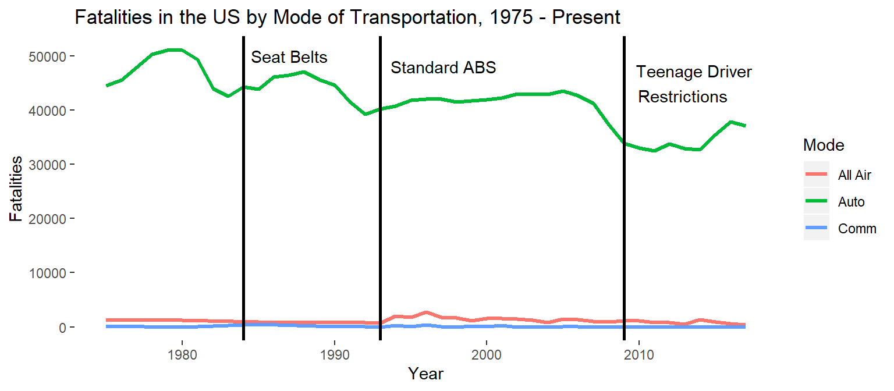

# Wine Quality Analysis
[View on GitHub](https://github.com/midumass/DSC-640/tree/master/4.3) 

### Purpose
Using charts and geospatial data, this project tries to sell you on the safety or air travel over passenger vehicles.

### Technologies
* R
* Geospatial Data

### Data
[Travel Fatality Data](https://github.com/midumass/DSC-640/blob/master/4.3/fatalities_miles.xlsx)   
[Airport Location Data](https://github.com/midumass/DSC-640/blob/master/4.3/airports.csv)

### Results
Boeing has made the headlines lately with the grounding of their entire 737 MAX fleet but don’t let those issues steer you away from flying, our roads are far more dangerous than flying. Americans drive over 2897527 million miles per year in privately owned vehicles. These miles come in the form cars, SUVs, motorcycles, and pickups among other vehicles. With that volume of miles, accidents happen. In 2017 more than 2.7 million accidents occurred on American Highways. Of these accidents, 34247 resulted in fatalities. The US Traffic Bureau reported that 52645 vehicles were in those collisions resulting in more than 37133 lives lost and the numbers climb every year despite improved vehicle safety measures.

While safety improvements have slowed the number of fatalities drastically over the years, the fatalities are once again on the rise. Anti-lock brakes, standard front and side-curtain airbags and stability control, alongside more stringent teenage driving laws, have decreased the rate at which fatalities occur per mile but the rate is still staggering. In 2017, there was a privately owned vehicle fatality every 78 million miles driven.

The major domestic airlines, in contrast, have had a total of 158 incidents in the past 20 years. In the US, only 17 resulted in fatalities with the majority of those coming from terrorist activites on September 11, 2001. Since 2010 there have been zero fatal crashes on domestic flights. With so few incidents, the resulting mileage per accident rate in the airlines dwarfs that of the privately owned and operated ground vehicle.

Convenient Flights
Feel safer yet? The overall numbers of accidents on the roads isn’t going down, even if the number of miles driven per fatality is improving. The numbers in the skies however couldn’t be much better. If you’re looking for a way to travel, Let your commerical airline of choice get you to your destination. If you live in a large US city, chances are you know where your nearest airport is. If not, check below for a terminal nearby. This map shows the airports closest to the largest populations, coloured by the number of flights in and out. Just be careful getting there on the roads!

##### Source : https://maps.googleapis.com/maps/api/staticmap?center=29.763284,-95.363271&zoom=3&size=640x640&scale=2&maptype=terrain&key=xxx