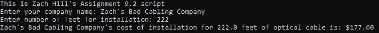

# Cable Cost Calculator
[View on GitHub](https://github.com/midumass/DSC-540/tree/master/9.2) 

### Purpose
This python script takes user input for a company and provides them a cost for installation of optical cabling in a specified number of feet. Price adjusts based on length.

### Technologies
* Python

### Sample Output
