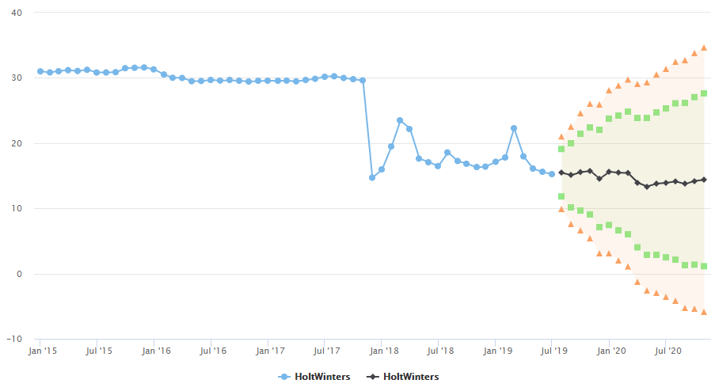

# NC Groundwater Predictive Analysis

### Purpose
With populations expoloding, water availability will become a major concern as it is in many places across the globe. This project analyzes the ground water levels in North Carolina for trends.

### Technologies
* R

### Data
[USGS National Water Information System](https://waterdata.usgs.gov/nwis) 

### Results
Water Wells Sites analyzed

Predictions on time series using linear regression

Predictions on time series using Holt-Winters
