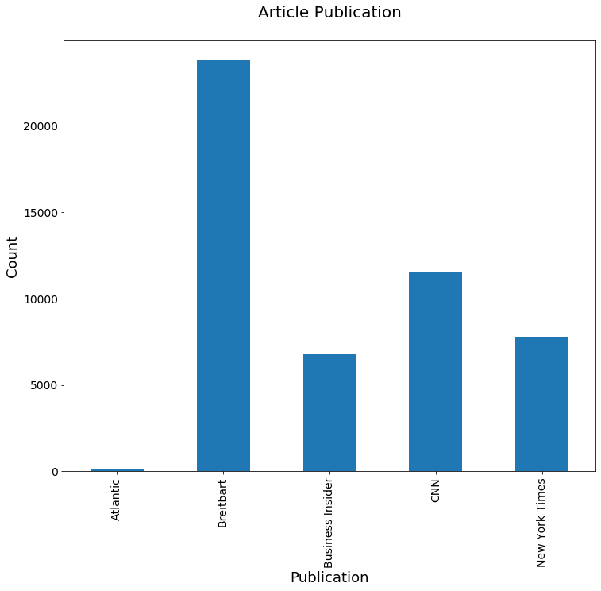
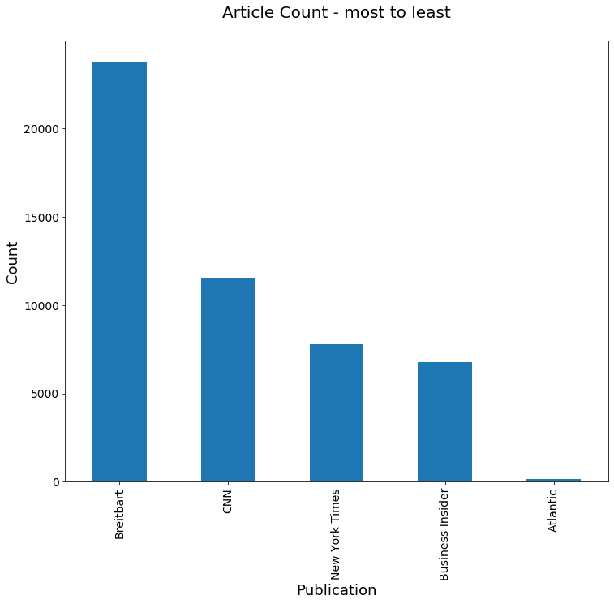
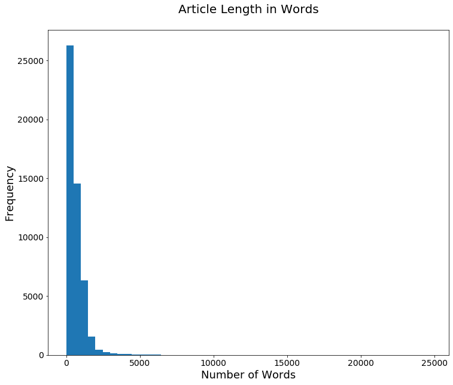

# News Analysis
[View on GitHub](https://github.com/midumass/DSC-550/tree/master/5.2) 

### Purpose
Analyze article data from different news agencies from article count and length to content.

### Technologies
* Python, jupyter

### Data
[Zipped Dataset](https://github.com/midumass/DSC-550/tree/master/5.2/articles1.zip)

### Results
Counts of articles from different news sources.

Sorted counts of articles from different news sources.

Text analysis depicting numbers of words in articles.
