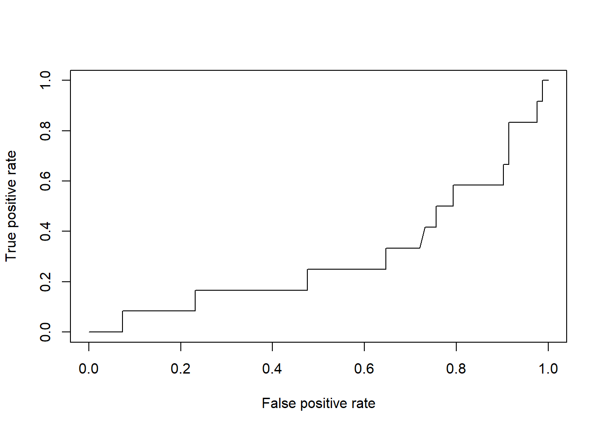

# ROC and AUC using R
[View on GitHub](https://github.com/midumass/DSC-520/tree/master/10.2) 

### Purpose
A look into using Area Under the Curve Receiver Operating Characteristics in R

### Technologies
* R

### Sample Output
