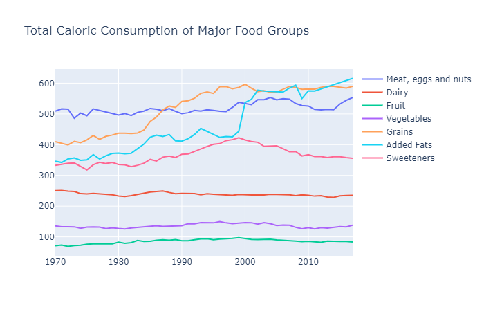
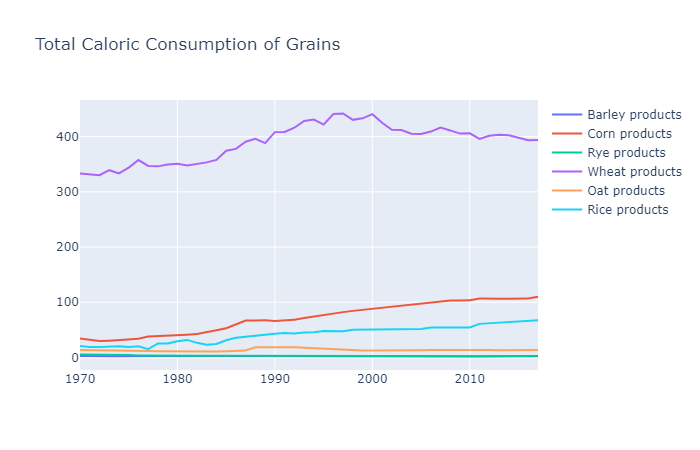
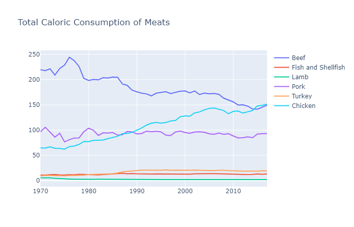
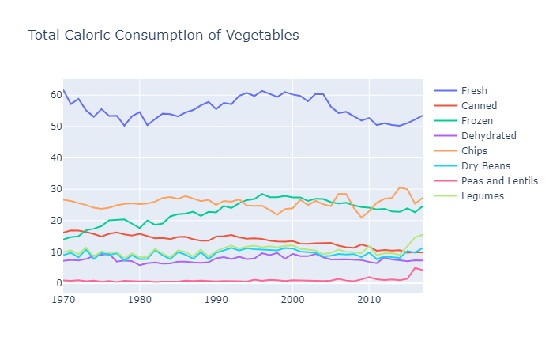
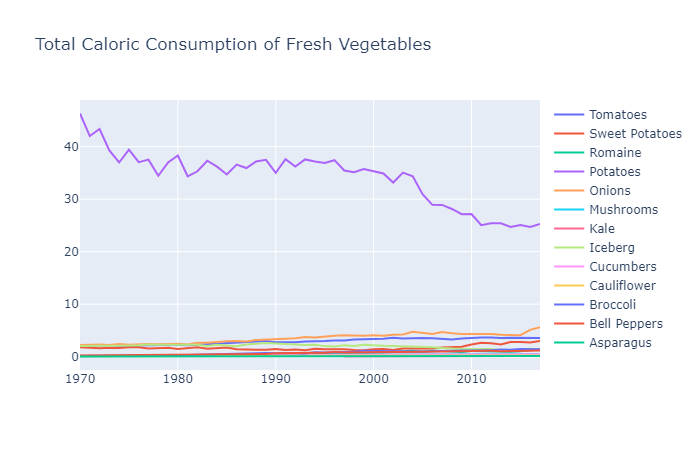
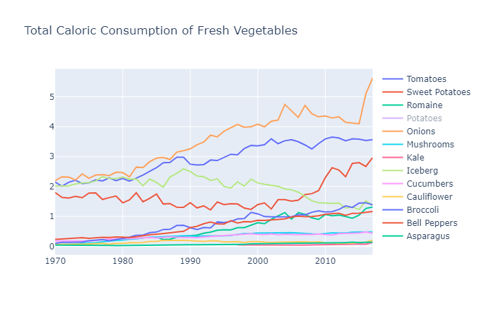
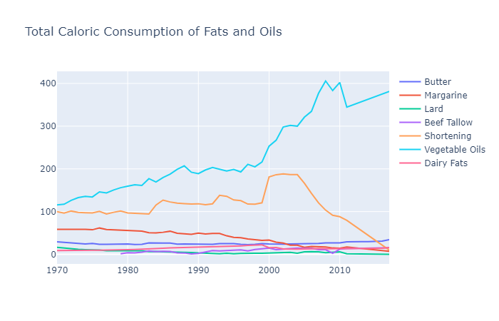

# SAD Dieting
[View on GitHub](https://github.com/midumass/SADieting/tree/master/) 

### Purpose
We have an epidemic on our hands in form of obesity. This epidemic began in the mid-1970’s and has spiraled out of control since. It has been claimed by countless nutrition specialists and health professionals that the cause is directly related to our eating sweets and fatty foods and the solution is to eat more vegetables, lean meats, and plant-based oils and nuts. Their claims are based mostly under the premise of preventing heart disease, a leading cause of death in most developed nations, while keeping us a healthy weight, but the western world has accomplished neither of those goals since this nutritional dogma has been put in place. What did the Standard American Diet look like in 1970, when obesity was non-existent, and what does it look like today? Are we really eating more of the foods that are claimed to cause these problems or could the nutritionists be wrong? This project looks at some relationships between how we eat now and how we ate before the obesity era.

### Technologies
* Python, plotly
* Correlations
* Data Visualizations

### Data
Data has been collected from the US FADS data system found [here](https://www.ers.usda.gov/data-products/food-availability-per-capita-data-system/)

### Results

This chart mostly agrees with the nutrition concensus. We eat more meat, fats, and sweeteners than in 1970 and fewer (or no more) vegetables and fruits. Are the health experts correct?

Here we see increases of rice, corn and wheat products while others remained flat. Unfortunately, there are no ancient grains reported by the USDA. It looks like we are meeting the goals presented by the experts.

Now though, we see the opposite of what we are taught. The consumption of high fat meats such as beef and pork have declined or remained flat since the 1970’s, while the rate at which poultry (lean meat) consumption has increased. Again, we are meeting the goals of the experts.

We see fresh vegetable consumption oscillating between increased and decreased consumption but overall decreasing over the timeframe. Oddly enough, our chip consumption has not increased overall by any remarkable degree. We should look deeper into fresh vegetables like experts want.

Now we see a problem. Fresh potato consumption has fallen by more than the drop in overall vegetable consumption, which means many other vegetables must have increased in their contribution to our diets during this timeframe. By removing potatoes from fresh vegetables, we see this first-hand.

In contradiction to all claims, almost all fresh vegetable consumption has increased excluding iceberg, or head, lettuce. This contradiction is especially noteworthy because consumption of all other “leafy greens” has increased. It appears we are, once again, meeting the experts' advice.

Again, these data reinforce the trend of “everything we’ve been told is wrong.” Our animal-based fat consumption has fallen or remained flat while our use of vegetable or plant-based oils (like olive oil) has increased dramatically. 

Unfortunately, it looks like our health experts aren't the experts they claim to be. Obesity is skyrocketing as we follow their low-fat, high-insulin diet. In attempting to avoid heart disease, thier recommendations have led us down a path of obesity, diabetes, and auto-immune disorders. Thanks doc, I'll take my bacon to go please.