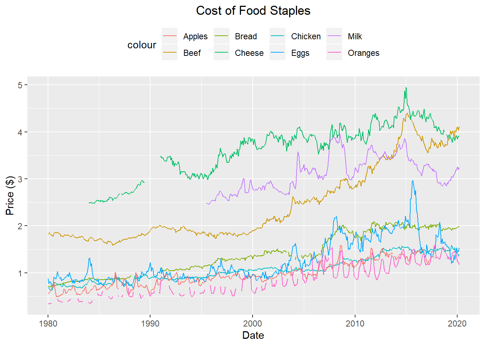

# Staple Food Costs
[View on GitHub](https://github.com/midumass/DSC-630/tree/master/1.3) 

### Purpose
Analysis of staple food costs in the US over the past 12 years to identify trends in cost of living

### Technologies
* R

### Data
[Food Staples Data from FADS](https://www.ers.usda.gov/data-products/food-availability-per-capita-data-system/) 

### Results
The cost of living increases over time. This is inevitable as markets grow, currencies change relative values and wages increase. Food staples, foods that almost all people eat and are used in most diets should be a good indicator of how the cost of living has increased over the years. The Bureau of Labor and Statistics has kept track of these items with faily good regularity since 1980. These reports investigate how those food staples’ prices have changed and prepares us to make predictions on how they will change in the future.

