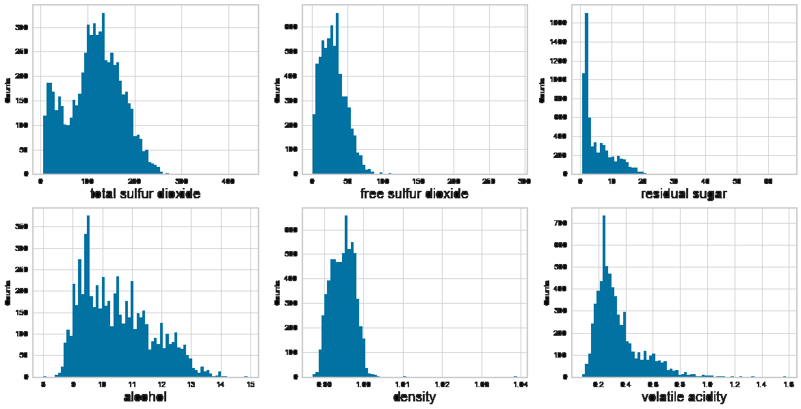

# Titanic
[View on GitHub](https://github.com/midumass/DSC-550/tree/master/8.2) 

### Purpose
Explore survival rates from the Titanic disaster from different factors

### Technologies
* Python, jupyter

### Data
[Training Dataset](https://github.com/midumass/DSC-550/tree/master/8.2/train.csv)

### Results
Distributions of variables in dataset

Correlations of variables among data

Accuracy of model
