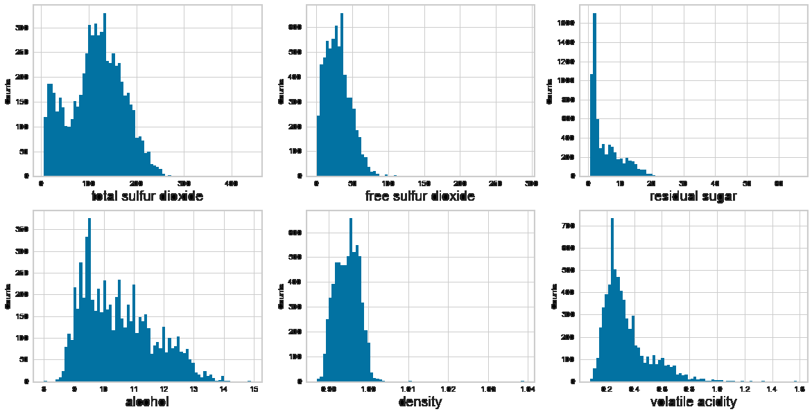
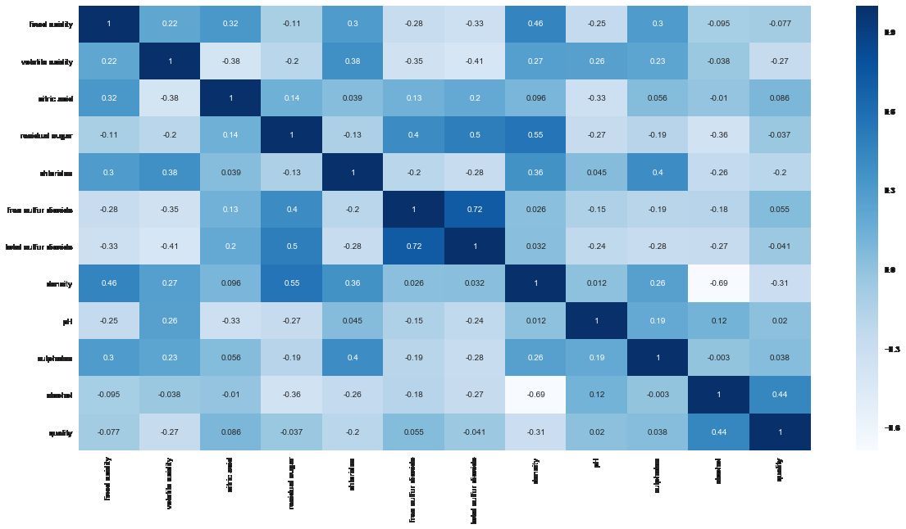
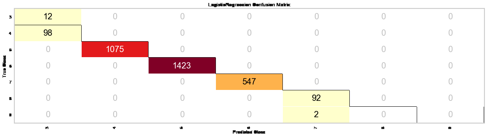

# Wine Quality Analysis
[View on GitHub](https://github.com/midumass/DSC-550/tree/master/11.2) 

### Purpose
As I sat there wondering what I should use as a case study, my wife was complaining about the quality of the individual-serving-size wine selection they had at the grocers. I've seen the wine dataset previously and always thought it would be interesting to play with, so here we are. My intention is to find the features that most correspond to my wife's likes so she can narrow down the list when she next goes to Total Wine.

### Technologies
* Python, jupyter

### Data
P. Cortez, A. Cerdeira, F. Almeida, T. Matos and J. Reis.
Modeling wine preferences by data mining from physicochemical properties.
In Decision Support Systems, Elsevier, 47(4):547-553. ISSN: 0167-9236.  

Available at:  
[@Elsevier](http://dx.doi.org/10.1016/j.dss.2009.05.016)  
[Pre-press (pdf)](http://www3.dsi.uminho.pt/pcortez/winequality09.pdf)
[bib](http://www3.dsi.uminho.pt/pcortez/dss09.bib)

### Results

