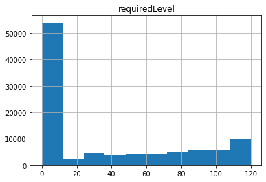
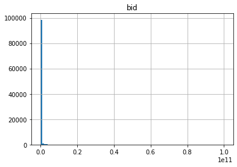
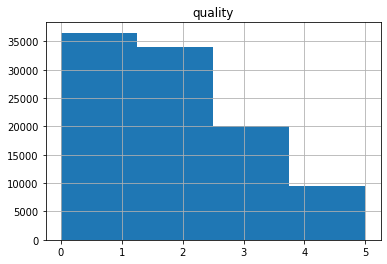

# WoW AH Analysis
[View on GitHub](https://github.com/midumass/DSC-530/tree/master/10.4) 

### Purpose
Analyzing data pulled from the World of Warcraft Auction House

### Technologies
* Python

### Data
[Sampled Dataset](https://github.com/midumass/DSC-530/blob/master/10.4/ah_item_small.csv) 

### Results




```py
bid = df['bid']
print('Mean =', bid.mean(),
      '\nMedian =', bid.median(), 
      '\nSD =', bid.std(), 
      '\nVariance =', bid.var())

Mean = 154722561.31587 
Median = 6004355.0 
SD = 2389442273.198373 
Variance = 5.709434376947407e+18
```