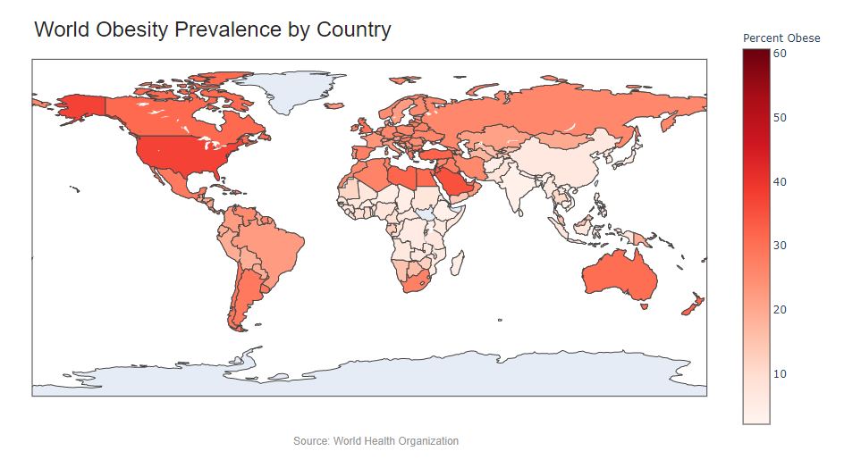
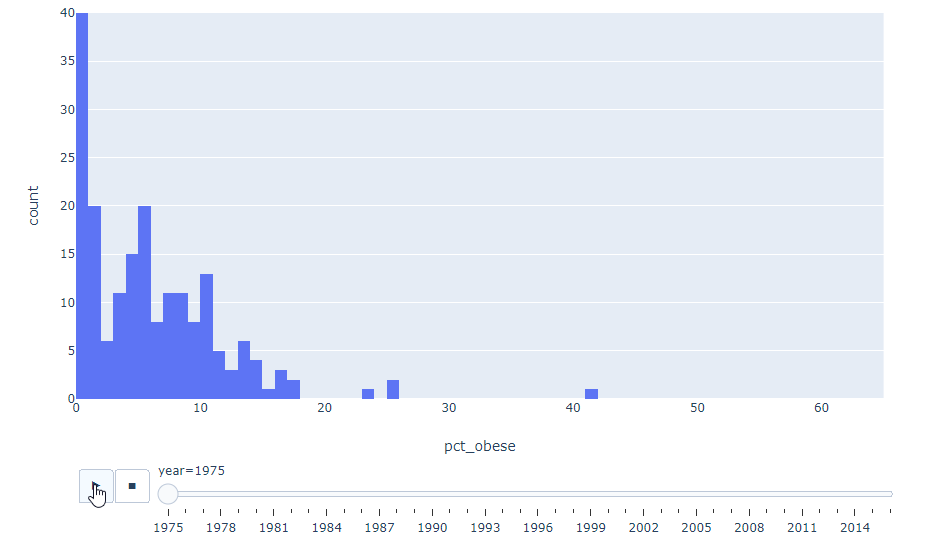
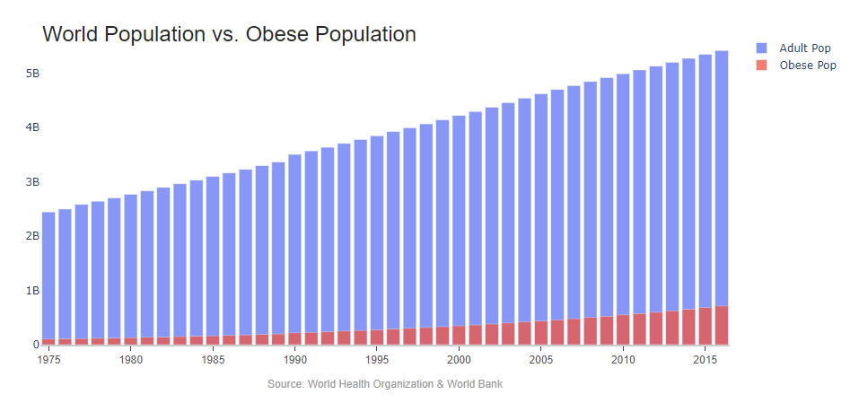
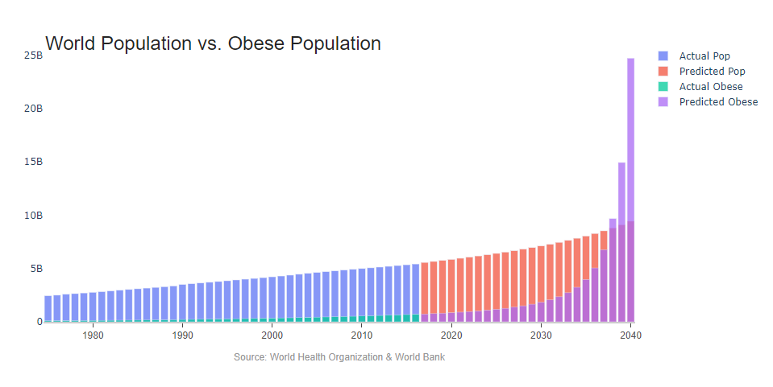

# World Obesity

### Purpose
Obesity in the United States has long been in the news due to its association with health risks and the cost burden it places on the entire population.  Those health risks include heart disease, stroke, type 2 diabetes and certain types of cancer that are some of the leading causes of preventable, premature death. Alongside the health-related problems is a drastic increase in cost. Compared with normal weight individuals, obese patients incur 46 percent increased inpatient costs, 27 percent more physician visits and outpatient costs, and 80 percent increased spending on prescription drugs. These costs are paid for by everyone, not just the obese individuals in question. 

One of the most prevalent diseases associated with obesity is Diabetes Mellitus, particularly Type 2 Diabetes. The prevalence of this non-communicable disease more than doubled every year from 1990 through 2008, although there are indications that the rate of growth is starting to fall in some areas. The demand for insulin resulting from this ridiculous growth has caused shortages in the drug, leaving prices skyrocketing over the past ten years. It is now estimated that the population of insulin-dependent people on earth will more than double by 2030, without any means of producing enough insulin to treat them all. Without the means of producing the drug people will begin dying at alarming rates, and as we push more and more resources into producing this substance the costs will grow ever higher. If governments, like Canada, put price caps on the drug, the production won’t be profitable enough to continue and it will come down to taxpayers having to pay for it entirely. This is just one side effect of obesity and the lifestyle causing it. 

A second disease highly associated with obesity is heart disease. Three major factors contributing to cardiovascular diseases are high blood pressure, high cholesterol and diabetes. These three factors correlate directly with obesity, to the tune of at least 68% of patients 65 or older with heart disease also have diabetes, a number too great to be coincidence.  

### Technologies
* Python, plotly
* Time-Series and Statistical Analysis
* Data Visualizations

### Data
Two datasets were compiled to analyze the prevalence of obesity; one for the obesity numbers themselves, provided by the World Health Organization and one from the World Bank for population analysis. The two were merged to allow analysis of obesity by both country and raw population numbers. While both datasets are considered crude estimates, all should be relative. 

The World Health Organization (WHO) dataset can be downloaded from [here](https://www.who.int/data/gho/data/themes/theme-details/GHO/body-mass-index-(bmi)).

The World Bank Population data can be found [here](https://datacatalog.worldbank.org/dataset/population-estimates-and-projections).

### Results
To understand obesity we need to understand first how prevalent it is. It is not limited to rich or poor, it is becoming an epidemic everywhere as indicated below.

We see some nations have far higher rates than others, but we also see that no country is immune. This is a drastic change from the early 1970's. In 1975, more than a quarter of nations reported obesity rates below 1%. Today, no nations report below 1% and only one reports obesity rates under 3%.

This marked change is important. As the obesity dilema evolves, more and more nations will suffer the effects. Today, many nations have more obese adults than non-obese and many more are coming close. The total population is climbing rapidly, but the obese population is increasing at an even greater rate. 

Where will this leave us in 20 years? At current rates of increase, the entire adult population could be obese. 

Imagine how much healthcare will cost then.

Code and Data can be pulled from the linked repository found [here](https://github.com/midumass/World_Obesity/tree/master/).